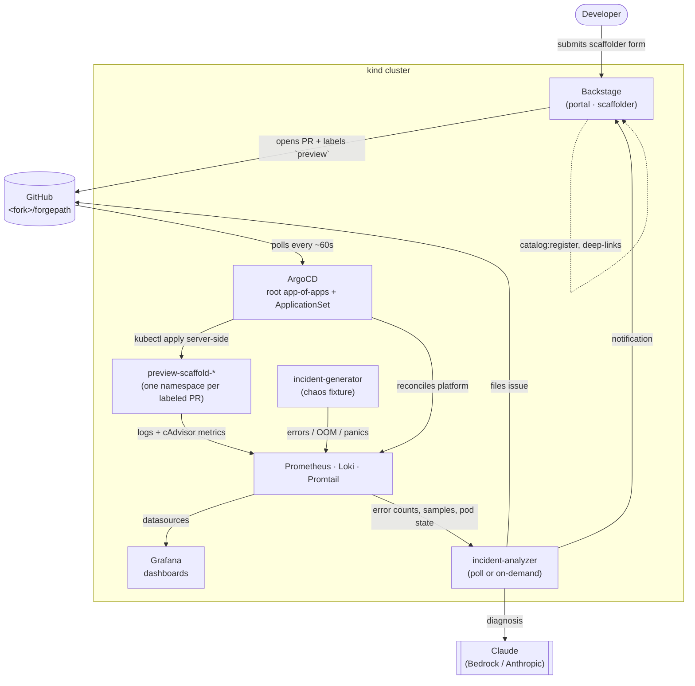
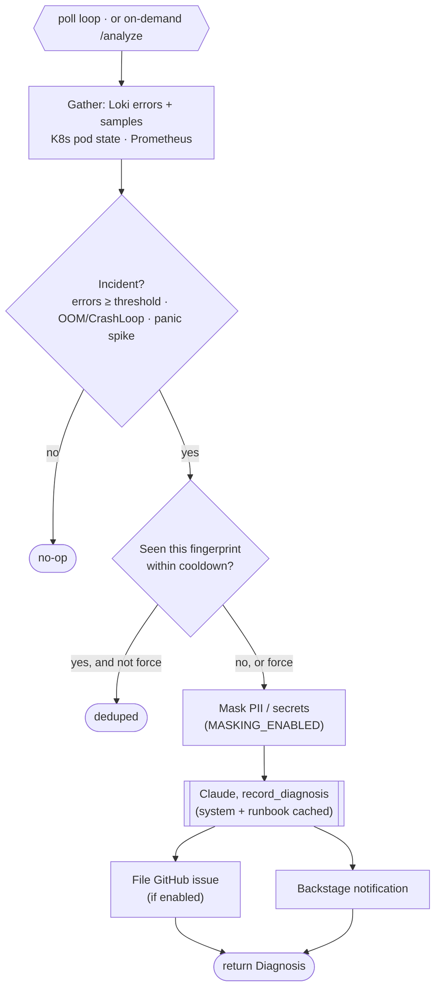

# Architecture

A high-level read for someone evaluating the repo before spinning it up. For the post-install operator view, see the TechDocs version inside Backstage at <http://localhost:7007/docs/default/component/forgepath-platform>.

## High-level topology



## Repo layout

```
forgepath/
├── platform/                # Sources (human-edited)
│   ├── argocd/install/      # Kustomize base for the ArgoCD install
│   ├── argocd/bootstrap/    # Cluster-level resources (root-app)
│   ├── backstage/           # Catalog, scaffolder templates, overlay
│   └── docs/                # TechDocs source served inside Backstage
│
├── gitops/                  # The source of truth ArgoCD watches
│   ├── apps/                # ArgoCD Applications + previews ApplicationSet
│   ├── platform/            # Platform component manifests (prom/loki/grafana/backstage/incident-*)
│   └── workloads/           # Preview workloads (populated by PRs)
│
├── services/                # Source for the platform's own services
│   ├── incident-generator/  # Go chaos fixture (errors/OOM/panics on purpose)
│   └── incident-analyzer/   # Python/FastAPI AI incident detector (Claude)
│
├── local/                   # backstage/ is generated & gitignored; the rest is tracked
│   ├── backstage/           # Scaffolded Backstage app + forgepath overlay (gitignored)
│   └── kind-config.yaml     # Cluster shape + port mappings (committed source)
│
├── scripts/                 # Bootstrap and sync helpers (Bash)
└── docs/                    # This documentation (read on GitHub)
```

## Components

| Component  | What it does                                                  | Why this choice                                                            |
|------------|---------------------------------------------------------------|----------------------------------------------------------------------------|
| Backstage  | Developer portal, catalog, scaffolder, Kubernetes tab, TechDocs | The reference Internal Developer Portal. Big plugin ecosystem.             |
| ArgoCD    | Polls Git, reconciles into the cluster                        | Pull-based GitOps, no cluster credentials living in CI.                    |
| ApplicationSet (`previews`) | One ArgoCD Application per labeled PR              | The PR is the lifecycle handle, no out-of-band state.                     |
| Prometheus | Scrapes kubelet/cAdvisor + annotation-discovered pods         | Container CPU/memory for every pod without app-side instrumentation.       |
| Loki       | Stores logs (filesystem, monolithic single-binary)            | Demo-sized, label-indexed querying, native Grafana integration.            |
| Promtail   | DaemonSet that tails `/var/log/pods/` on each node            | Zero per-service wiring, every pod gets log ingestion automatically.      |
| Grafana    | Dashboards + datasources, auto-provisioned via ConfigMaps     | Single pane for metrics and logs.                                          |
| incident-generator | Go chaos fixture, emits errors / OOM / panics on a loop and on demand | Gives the observability stack (and the analyzer) something realistic to chew on. |
| incident-analyzer  | Watches Loki/Prometheus/K8s, asks Claude to diagnose, files a GitHub issue + Backstage notification | Closes the loop: detection → diagnosis → human-actionable surface. |
| kind       | Single-node K8s in Docker                                     | Cheap, fast to recreate, portable across macOS / Linux / WSL.              |

## GitOps flow

1. **Boot**: `make local-up` applies `platform/argocd/install` (the ArgoCD bundle) and then the **root app-of-apps** (`platform/argocd/bootstrap/root-app.yaml`), which points at `gitops/apps/` with `recurse: true`.
2. **Discovery**: ArgoCD discovers `backstage.yaml`, `grafana.yaml`, `loki.yaml`, `prometheus.yaml`, `incident-generator.yaml`, `incident-analyzer.yaml`, and the `previews` ApplicationSet under `gitops/apps/`. Each is an Application targeting a Kustomize base under `gitops/platform/<component>/`.
3. **Reconciliation**: ArgoCD pulls those manifests from Git and applies them server-side. Image tags, dashboards, retention, everything that changes the platform shape goes through a commit.
4. **Previews**: the `previews` ApplicationSet uses the `pullRequest` generator. Any PR carrying the `preview` label spawns an `preview-scaffold-<name>` Application that deploys the PR branch's `gitops/workloads/<name>/k8s/*.yaml` into the namespace of the same name.
5. **Cleanup**: closing the PR removes the PR from the generator's output → the Application disappears → `resources-finalizer.argocd.argoproj.io` deletes the namespace and everything inside.

The deploy → preview → teardown lifecycle, end to end:

```mermaid
sequenceDiagram
    actor Dev as Developer
    participant BS as Backstage
    participant GH as GitHub
    participant AS as ApplicationSet
    participant Argo as ArgoCD
    participant NS as preview-scaffold-&lt;name&gt;

    Dev->>BS: Fill "Deploy a service" form
    BS->>GH: Open PR (gitops/workloads/&lt;name&gt;/) + preview label
    BS->>BS: catalog:register Component (immediate)
    loop every ~60s
        AS->>GH: Poll PRs labeled preview
    end
    AS->>Argo: Create preview-scaffold-&lt;name&gt; Application
    Argo->>NS: kubectl apply (CreateNamespace=true)
    NS-->>Dev: Pod running · logs→Loki · metrics→Prometheus
    Dev->>BS: "Destroy a service" → github:closePullRequest
    BS->>GH: Close PR
    AS->>Argo: Drop Application (PR gone from generator)
    Argo->>NS: Finalizer deletes namespace + contents
```

## Namespace strategy

Each preview lives in `preview-scaffold-<name>` where `<name>` is the service name from the scaffolder form. The namespace is **deterministic from the branch name** (`scaffold-<name>`), which means:

- Grafana deep-links from each catalog entity use the exact namespace as a URL variable (no regex, no fall-through to "All")
- The catalog entry, the ArgoCD Application, and the namespace all share the `<name>` suffix, one identifier, three places
- Service names are capped at 46 chars to leave room for the `preview-scaffold-` prefix under K8s's 63-char namespace limit

The `previews` ApplicationSet enforces `CreateNamespace=true` so manifests must NOT set their own `namespace:` field, the destination namespace controls placement.

## Observability flow

- **Metrics**: Prometheus uses two scrape jobs, one against `kubernetes.default.svc/api/v1/nodes/<node>/proxy/metrics/cadvisor` for container CPU/memory (every pod, no wiring), and a pod-discovery job that picks up any pod annotated with `prometheus.io/scrape: "true"` (opt-in for app-side `/metrics`).
- **Logs**: Promtail runs as a DaemonSet, tails `/var/log/pods/` on each node, enriches each line with `namespace` / `pod` / `container` labels, and pushes to Loki's HTTP endpoint. Loki stores chunks on a filesystem backend with 72h retention.
- **Visualization**: Grafana ships with three auto-provisioned dashboards (`Cluster pods` from Prometheus, `Service logs` and `Logs · Error explorer` from Loki). Each scaffolded service's catalog entry includes deep links into these dashboards with the namespace variable pre-filled.

## AI incident detection

The same observability data feeds a detection loop, both standing platform services (deployed by ArgoCD from `gitops/platform/incident-*`, built from `services/`):

- **incident-generator** (Go) is a deliberate chaos fixture. A background goroutine emits a mix of healthy and error JSON logs; on-demand endpoints (`/boom`, `/panic`, `/slow`, `/leak`, `/crash`) trigger specific failures, latency, OOM growth, CrashLoopBackOff. A subset of errors leak fake PII (emails, cards, IBANs) in the log line only, as a masking fixture.
- **incident-analyzer** (Python/FastAPI) polls Loki (error counts + samples), the K8s API (OOMKilled / CrashLoopBackOff), and Prometheus. On an any-of trigger, errors ≥ threshold, a bad pod condition, or a recovered-panic spike, it fingerprints the incident (dedup against a re-file cooldown), **masks** sensitive shapes out of the samples, then asks **Claude** (via AWS Bedrock or the direct Anthropic API) for a structured diagnosis citing the service's TechDocs runbook. The result is filed as a **GitHub issue** and a **Backstage notification**.

It runs either on a poll loop (`POLL_ENABLED`) or purely on demand, the `analyze-incident` scaffolder template calls the `incident-analyzer:analyze` action, so an operator can run one analysis from a Backstage form and read the diagnosis back in the task page. Each surfacing path degrades independently (no LLM creds → detect only; no token → skip issue/notification). See [`services/incident-analyzer/README.md`](../services/incident-analyzer/README.md) for the full config.



## Boundaries (intentional)

- Backstage **never** applies manifests directly. It only produces PRs.
- ArgoCD **never** runs custom logic. It reconciles Git → cluster.
- The kind cluster has no inbound from GitHub, ArgoCD does the pulling.
- Secrets (the PAT) stay in cluster namespaces. They're generated from `$GITHUB_TOKEN` at boot, never committed.
- `selfHeal` is on for previews (Git is the source of truth, so kubectl edits snap back), off for platform components (let an operator debug in-place before reconciling).
